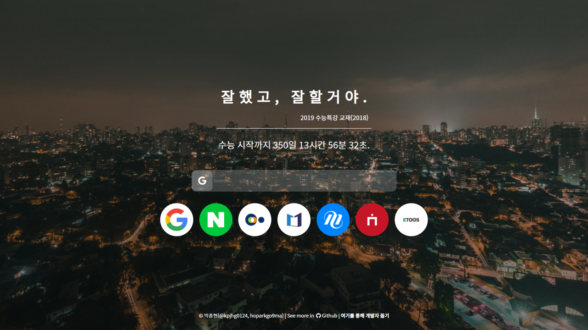

# rise: 잘했고, 잘할거야.
> Prove yourself and RISE
>
> _- RISE, Riot Music Team_

## 개요

[See Page on Here](https://rise.ho9.me)

rise는 [hellopage.today](https://github.com/Juneyoung-Kang/hellopage.today)의 포크본이었던 [hello-2019-sat](https://github.com/kpjhg0124/hello-2019-sat)에 대한 기숙사 내부반응을 토대로 타 프로젝트 코드 포함 없이 처음부터 다시 시작하는 수능 카운터 프로젝트입니다. 기간에 따라 랜덤하게 응원 문구가 변경되며, 구글 및 네이버 검색기능이 포함되어 있습니다.

## 기여 가이드
[contribute.md](./contribute.md)를 참고하세요.

## 저자
 * 박종현(hoparkgo9ma) - _첫 삽_ - [@kpjhg0124](https://github.com/kpjhg0124)

## 라이선스
이 프로젝트는 [MIT 허가서](./LICENSE)에 의해 보호받고 있습니다. 이 프로젝트를 사용하기 위해서는 MIT 허가서에 명시된 사항을 모두 이행해야합니다.
